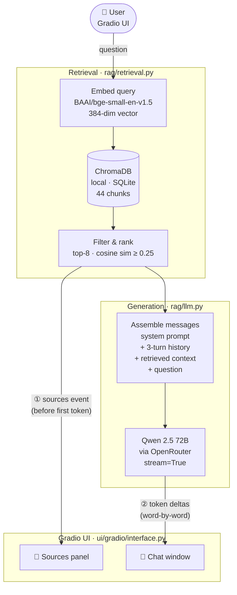

# Ask Andela

[](https://www.python.org/)
[](https://www.trychroma.com/)
[](https://gradio.app/)
[](https://openrouter.ai/)
[](https://huggingface.co/BAAI/bge-small-en-v1.5)
[](https://docs.astral.sh/uv/)
[-brightgreen)](./eval_results.json)

> **The single source of truth for the A3 AI Engineering cohort.**

Ask Andela is a RAG-powered assistant grounded in the cohort's own Discourse channels and programme resources. Ask it anything that lives in those materials — deadlines, tools, submission criteria, daily update formats, Solidroad assignments — and it will answer accurately, cite its sources, and stream the reply token-by-token. It will not fall back on generic internet knowledge.

---

## Architecture



The pipeline has two streaming phases: retrieval completes first and fires a `sources` event so citations appear immediately; the LLM then streams token deltas into the chat window word-by-word. Both paths are orchestrated by `stream_andela()` in `rag/pipeline.py`.

---

## Features

- **Curriculum-grounded answers** — retrieves from the cohort's own documents before generating; never hallucinates generic content
- **Source citations** — every answer shows which document(s) it was drawn from, populated before the first token arrives
- **Token-by-token streaming** — answers render live in the Gradio UI via `stream_answer()` / `stream_andela()`, no waiting for the full response
- **Conversation memory** — maintains a 3-turn history window so follow-up questions resolve correctly
- **Asymmetric retrieval** — `BAAI/bge-small-en-v1.5` is trained for question-to-passage matching (not symmetric sentence similarity), giving sharper top-K results
- **Local & free to run** — ChromaDB runs on SQLite, embeddings run on CPU, LLM served via OpenRouter
- **Gradio UI** — single-page interface ready for live demo; supports `--share` for a public link
- **Automated evaluation harness** — scores Baseline vs RAG across three criteria (accuracy, specificity, conciseness) with a max of 9 points per question
- **89% evaluation score** — RAG pipeline achieved 8/9 on our baseline evaluation set across all three criteria
- **Fine-tuning ready** — QLoRA fine-tune script in `finetune/` and a fine-tune dataset generator in `scripts/`

---

## Corpus

13 documents across two categories, totalling ~62k characters:

| File | Category | Content |
|------|----------|---------|
| `channel_general_chat.txt` | Discourse channel | Peer discussions, informal Q&A, and general cohort conversation |
| `channel_igniters_information.txt` | Discourse channel | Updates and guidance specific to the Igniters programme track |
| `channel_protocol_daily_updates.txt` | Discourse channel | Format guide and history of daily progress standup posts |
| `channel_solidroad_behavioral_assignments.txt` | Discourse channel | Solidroad roleplay assignment threads, submissions, and feedback |
| `channel_staff_announcements.txt` | Discourse channel | Official deadlines, schedule changes, and notices from staff |
| `resource_additional_learning_material.txt` | Course resource | Curated supplementary reading, videos, and external links |
| `resource_community_map.txt` | Course resource | Team directory, squad allocations, and community contacts |
| `resource_deliverables.txt` | Course resource | Capstone project submission requirements and assessment criteria |
| `resource_group_project_guidelines.txt` | Course resource | Collaboration norms, team roles, and group project rules |
| `resource_program_expectations.txt` | Course resource | Code of conduct, attendance policy, and professional norms |
| `resource_solidroad.txt` | Course resource | Solidroad platform guide, assignment formats, and scoring rubric |
| `resource_toolkit.txt` | Course resource | Recommended tools, environment setup guides, and install instructions |
| `resource_welcome_page.txt` | Course resource | Bootcamp overview, cohort schedule, and orientation information |

To add more documents (PDFs, additional `.txt` exports), drop them into `data/` and re-run `python ingest.py`.

---

## Project Structure

```
ask_andela_cohort/
│
├── rag/                          # Core RAG package
│   ├── config.py                 # All constants: paths, models, chunking params
│   ├── loader.py                 # Load .txt / .pdf files from data/
│   ├── chunker.py                # Token-based chunking (400 tok / 50 overlap)
│   ├── vectorstore.py            # Embedding model + ChromaDB build/load
│   ├── retrieval.py              # Embed query → top-K chunks (with history)
│   ├── llm.py                    # OpenRouter client, prompts, blocking + streaming generation
│   ├── pipeline.py               # ask_andela() + stream_andela() — full end-to-end RAG
│   ├── scoring.py                # Automated scoring: accuracy / specificity / conciseness
│   └── __init__.py
│
├── ui/
│   └── gradio/
│       ├── interface.py          # Gradio Blocks app with streaming chat handler
│       └── styles.css            # Custom stylesheet
│
├── data/                         # Source documents (txt + optional PDFs)
│
├── finetune/
│   └── finetune.py               # QLoRA fine-tune script (PEFT + TRL)
│
├── notebooks/
│   └── ask_andela_rag_pipeline.ipynb   # Exploratory notebook (all sections)
│
├── scripts/
│   └── generate_finetune_from_eval.py  # Generate fine-tune pairs from eval output
│
├── tests/
│   ├── run_scoring_demo.py       # Demo + verify the scoring module
│   └── eval_test_set.json        # Expected answer points per eval question
│
├── app.py                        # Entry point  →  python app.py
├── ingest.py                     # Build vectorstore  →  python ingest.py
├── evaluate.py                   # Run evaluation  →  python evaluate.py
│
├── .env.example                  # Copy to .env and add your API key
├── pyproject.toml
└── requirements.txt
```

---

## Quickstart

### Prerequisites

- Python 3.12
- [uv](https://docs.astral.sh/uv/) (recommended) or pip
- An [OpenRouter](https://openrouter.ai/) API key — free tier is sufficient

### 1. Clone & install

```bash
git clone https://github.com/<your-org>/ask_andela_cohort.git
cd ask_andela_cohort

# With uv (recommended)
uv venv && uv sync

# Or with pip
python -m venv .venv && source .venv/bin/activate
pip install -r requirements.txt
```

### 2. Set your API key

```bash
cp .env.example .env
```

Add to `.env`:

```
OPENROUTER_API_KEY=sk-or-...
```

### 3. Build the vector store

Run once. Re-run whenever you add documents to `data/`.

```bash
python ingest.py
```

Expected output:
```
[1/3] Loading documents from .../data ...
      13 documents loaded
[2/3] Chunking ...
      44 chunks created
[3/3] Building vector store ...
✓  Done. Run `python app.py` to start the UI.
```

### 4. Launch the UI

```bash
python app.py           # local only  →  http://127.0.0.1:7860
python app.py --share   # public Gradio link (for live demo)
```

---

## Changing the LLM

All model configuration lives in `rag/config.py`. Swap one line:

```python
# Current default (strong quality, free tier on OpenRouter)
LLM_MODEL = "qwen/qwen-2.5-72b-instruct"

# Paid alternatives (higher quality)
LLM_MODEL = "openai/gpt-4o-mini"
LLM_MODEL = "anthropic/claude-3-haiku"

# Other free options
LLM_MODEL = "meta-llama/llama-3.1-8b-instruct:free"
LLM_MODEL = "mistralai/mistral-7b-instruct:free"
```

> **Note on the embedding model:** `BAAI/bge-small-en-v1.5` was chosen over `all-MiniLM-L6-v2` because it is trained for *asymmetric* retrieval (question → passage) rather than symmetric sentence similarity. Changing `EMBEDDING_MODEL` in `config.py` requires re-running `ingest.py` to rebuild ChromaDB.

---

## Evaluation

The evaluation runner compares Baseline (no RAG) vs RAG on 12 held-out questions. Scoring is automated via `rag/scoring.py` using keyword coverage, course-specificity, and conciseness heuristics (1–3 scale, max 9 per question).

```bash
python evaluate.py              # baseline + RAG  (~24 API calls, ~2 min)
python evaluate.py --no-baseline  # RAG only  (~12 calls, saves API spend)
```

Results are saved to `eval_results.json`. To verify scoring logic independently:

```bash
python tests/run_scoring_demo.py
```

### Baseline evaluation results

Scored across all 12 held-out questions on a 1–3 scale per criterion (max 9):

| Criterion | What it measures | Baseline (no RAG) | RAG pipeline |
|-----------|-----------------|:-----------------:|:------------:|
| **Accuracy** | Keyword coverage of expected answer points | 1/3 | ✅ 3/3 |
| **Specificity** | Use of course-specific tools and concepts | 1/3 | ✅ 3/3 |
| **Conciseness** | Answer length appropriate to the question | 3/3 | ✅ 2/3 |
| **Total** | | **5/9** | **8/9 (89%)** |

The baseline scores high on conciseness because it gives short generic answers; RAG trades a little length for dramatically better accuracy and specificity.

### Results schema per question

| Column | Description |
|--------|-------------|
| `baseline_answer` | LLM answer with no retrieved context |
| `rag_answer` | LLM answer with top-8 retrieved chunks |
| `finetuned_rag_answer` | *(Day 2)* QLoRA fine-tuned model + RAG |
| `*_accuracy` | Keyword coverage score 1–3 |
| `*_specificity` | Course-term usage score 1–3 |
| `*_conciseness` | Answer length score 1–3 |

---

## Design Decisions

| Decision | Rationale |
|----------|-----------|
| `BAAI/bge-small-en-v1.5` over `all-MiniLM-L6-v2` | BGE is trained for asymmetric retrieval (question→passage); MiniLM is trained for symmetric sentence similarity. BGE scores valid passages higher at a consistent threshold (0.25 vs 0.15). |
| `qwen/qwen-2.5-72b-instruct` over `llama-3.1-8b-instruct:free` | Llama 3.1 8B produced noticeably weaker answers on programme-specific queries. Qwen 2.5 72B produces significantly better results on the free tier with similar latency. |
| `TOP_K = 8` | Broad questions (e.g. programme expectations) span multiple source files; fetching 8 chunks then filtering by threshold (0.25) gives better coverage than the original top-5. |
| Streaming split into two events (`sources` then `token`) | Allows the sources panel to populate immediately after retrieval, before the first LLM token arrives — improving perceived responsiveness. |
| Conversation history window (3 turns) | Enough context to resolve follow-ups ("what about week 3?", "are you sure?") without exceeding free-tier context limits. |

---

## Roadmap

- [x] RAG pipeline (ChromaDB + OpenRouter)
- [x] `BAAI/bge-small-en-v1.5` asymmetric retrieval embeddings
- [x] Gradio UI with source citations
- [x] Token-by-token streaming in UI via `stream_andela()`
- [x] Conversation memory (3-turn history window)
- [x] Automated evaluation harness (Baseline vs RAG, 3 scored criteria)
- [x] 8/9 score (89%) on baseline evaluation set
- [x] QLoRA fine-tune script (`finetune/finetune.py`) and fine-tune dataset generator
- [ ] Three-way eval comparison for demo (Baseline → RAG → Fine-tuned+RAG)

---

## Team

| Name | Role |
|------|------|
| Eben | Product, PRD |
| Amit | Data collection & Q&A pair generation |
| Phillip | RAG pipeline |
| Kayode | Fine-tuning (QLoRA) |
| Tunde | Gradio UI & streaming |
| Mugao | Evaluation & scoring |

---

## Tech Stack

| Component | Tool |
|-----------|------|
| Vector store | ChromaDB (local SQLite) |
| Embeddings | `BAAI/bge-small-en-v1.5` (asymmetric retrieval) |
| LLM gateway | OpenRouter |
| Default model | `qwen/qwen-2.5-72b-instruct` |
| Streaming | OpenAI SDK streaming (`stream=True`) via OpenRouter |
| Fine-tuning | PEFT + QLoRA (`trl`, `transformers`) |
| UI | Gradio |
| Doc parsing | Plain text + PyMuPDF (PDFs) |
| Package manager | uv |
